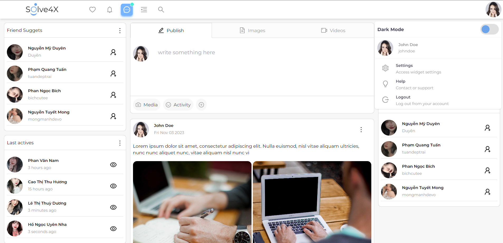

# Đồ án cơ sở I | Solve4X Team



## Introductions

- Dự án này là Đồ Án Cơ Sở I.
- **Đề tài:** Xây dựng giao diện website mạng xã hội Solve4X

## Targets

- Tạo ra một giao diện trang web thân thiện, dễ sử dụng.
- Áp dụng các kiến thức đã học, thực hành kĩ năng phát triển trang web.

## Members

- Lê Thế Dũng (22IT049)
- Phạm Văn Ngọc Vinh(22AD)

## Installation

```bash
git clone https://github.com/dunnyourluv/social-web
cd web-last
npm i
npm run dev
```
